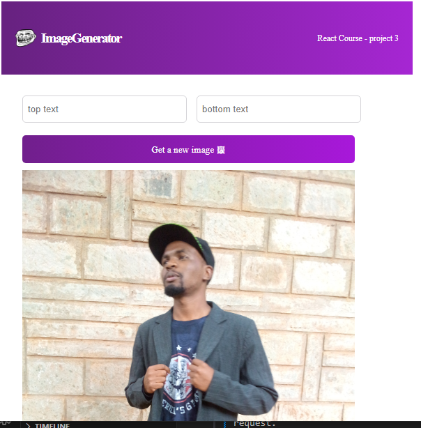

# My Travelling Journal
Welcome to my Image Generator webpage!This webpage randomly generates new images on clicking the get new image button.

You can access the live version of the Readme file by clicking this link: 
## Tools
The website is developed using;
- HTML5
- CSS3
- React framework
## Prequisites
1. A ``terminal`` for those on **Linux** or **MacOS** and ``Gitbash`` for those on **windows**.
2. Visual Studio code or any editor where the code will be displayed.
3. Make sure you have Node.js installed on your machine.
- ``Node.js``: [Download Node.js](https://nodejs.org/en)
## Set up
To set up this project, follow these steps:
1. Clone this repository to your local machine:
```
https://github.com/Issa783/image-generator.git
```
2. Navigate to your project directory
```
cd Image-generator
```
3. Run this code command either in gitbash or command prompt to install dependencies:
```
npm install
```
4. Then start the development server
```
npm start
```
Now, you can view the Digital Business Card in your web browser at http://localhost:3000.
## Screenshots

## Author
This website is developed by:

[John Mutua](https://github.com/Issa783)
## Contributing
Contributions are welcome! If you find a bug, have a feature request, or want to contribute in any way, please open an issue or submit a pull request.
## License
The project is licensed under the [MIT License](https://choosealicense.com/licenses/mit/)


